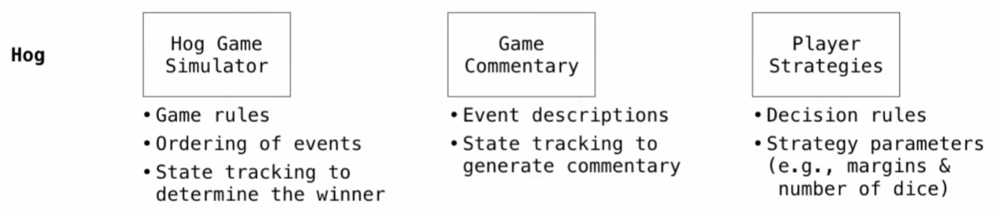

# 模块化设计

将处理不同功能的代码模块隔离开，建立工具箱，每个工具只需要考虑自己的功能

例如proj Hog:<br>

大型的抽象屏障

# 示例：餐厅搜索

......

# 示例：集合的交集（线性时间）

给定两个严格单调递增列表，返回他们相同元素个数（要求时间复杂度为$O(n)$）


```python
def fast_overlap(s, t):
    i, j, count = 0, 0, 0
    while i < len(s) and j < len(t):
        if s[i] == t[j]:
            count, i, j = count + 1, i + 1, j + 1
        elif s[i] < t[j]:
            i += 1
        else:
            j += 1
    return count
```
