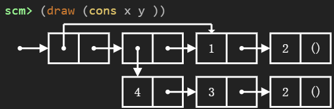
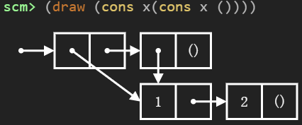

# List

cons：双参数过程，用于创建List（链表）<br>
car：first<br>
cdr：rest<br>
nil：empty（但是本文使用`()`）


```scheme
(cons 2 ())
```


    (2)


```scheme
(
 define x (cons 1 (cons 2 ()))
)
```


```scheme
x
```


    (1 2)


```scheme
(car x)
```


    1


```scheme
(cdr x)
```


    (2)


```scheme
(define y (cons (cons 4 (cons 3 (cons 2 ()))) x))
```




```scheme
(cons x y)
```


    ((1 2) (4 3 2) 1 2)


x是1->2的List，y是first是4->3->2，rest是x的List


```scheme
(cons x(cons x ()))
```


    ((1 2) (1 2))





```scheme
(null? ()) ;判断是否空
```


    True


# 符号编程

被引用的表达式本身就是值，而不是需要求值的对象


```scheme
(define awa 421)
'awa
```


    awa


```scheme
(quote pawaq);等价于 'pawaq
```


    pawaq


可用于组合各种元素，形成列表


```scheme
'(awa b c)
```


    (awa b c)


**注意！这不是字符串**


```scheme
(define x '(a b c))
```


```scheme
(car x)
```


    a


```scheme
(cdr x)
```


    (b c)


```scheme
(cons 'a (cons 'b ()))
```


    (a b)


```scheme
(list 1 'a)
;(list 1 a) 就会报错
```


    (1 a)


```scheme
(car(car (cdr '(1 (2 3) 4))))
```


    2


# 内置的List处理过程

`(append s t ...)`：将传入的列表合并为一个列表<br>
`(map f s)`：对列表s中每个元素调用过程f<br>
`(filter f s)`：创建一个包含对f为真值的s的元素的列表<br>
`(apply f s)`：将整个s作为参数传给f


```scheme
(define s (cons 1 (cons 2 ())))
```


```scheme
(define s4 (append s s s s))
```


```scheme
s4
```


    (1 2 1 2 1 2 1 2)


```scheme
(map (lambda (x) (+ 2 x) ) s4)
```


    (3 4 3 4 3 4 3 4)


```scheme
(filter even? s) ;解释器问题
```


    <filter at 0x1683ded2260>


```scheme
(apply + '(1 2 3 4)) ;sum
```


    10


```scheme
(apply / s4)
```


    1/16


# 示例：偶数和子集


```scheme
(define (even-subsets s)
  (if (null? s)
      '()
      (append
        (even-subsets (cdr s))
        (map (lambda (t) (cons (car s) t))
             (if (even? (car s))
                 (even-subsets (cdr s))
                 (odd-subsets (cdr s))))
        (if (even? (car s))
            (list (list (car s)))
            '()))
      )
)
(define (odd-subsets s)
  (if (null? s)
      '()
      (append
        (odd-subsets (cdr s))
        (map (lambda (t) (cons (car s) t))
             (if (odd? (car s))
                 (even-subsets (cdr s))
                 (odd-subsets (cdr s))))
        (if (odd? (car s))
            (list (list (car s)))
            '()))))
```


```scheme
(even-subsets '(3 4 5 7))
```


    ((5 7) (4 5 7) (4) (3 7) (3 5) (3 4 7) (3 4 5))


```scheme
(odd-subsets '(4 5 7))
```


    ((7) (5) (4 7) (4 5))


